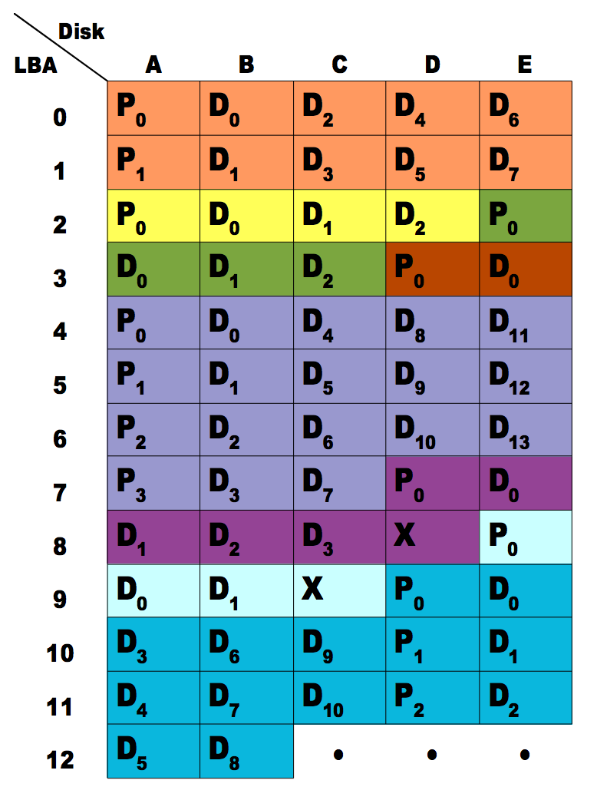
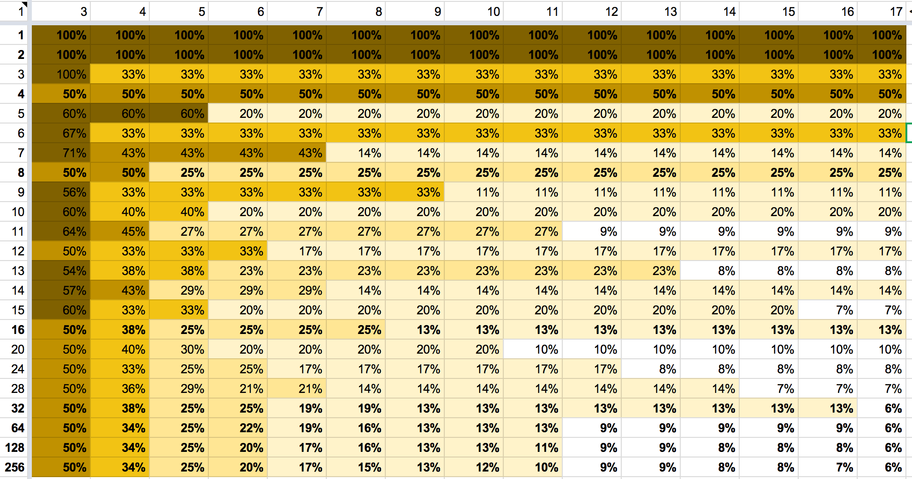

# ZFS RAIDZ stripe width, or: How I Learned to Stop Worrying and Love RAIDZ

## The popularity of OpenZFS has spawned a great community of users, sysadmins, architects and developers, contributing a wealth of advice, tips and tricks, and rules of thumb on how to configure ZFS.

The popularity of OpenZFS has spawned a great community of users, sysadmins, architects and developers, contributing a wealth of advice, tips and tricks, and rules of thumb on how to configure ZFS. In general, this is a great aspect of the ZFS community, but I'd like to take the opportunity to address one piece of misinformed advice about how many disks to put in each RAID-Z group (terminology: `zpool create tank raidz1 A1 A2 A3 A4 raidz1 B1 B2 B3 B4` has 2 RAIDZ groups or "vdevs", each of which has 4 disks or is "4-wide"). To do so, let's start by looking at what concerns play into choice of group width.

TL;DR: **Choose a RAID-Z stripe width based on your IOPS needs and the amount of space you are willing to devote to parity information.** If you need more IOPS, use fewer disks per stripe. If you need more usable space, use more disks per stripe. **Trying to optimize your RAID-Z stripe width based on exact numbers is irrelevant in nearly all cases.**

For **best performance on random IOPS**, use a small number of disks in each RAID-Z group. E.g, 3-wide RAIDZ1, 6-wide RAIDZ2, or 9-wide RAIDZ3 (all of which use a..." of total storage for parity, in the ideal case of using large blocks). This is because RAID-Z spreads each logical block across all the devices (similar to RAID-3, in contrast with RAID-4/5/6). For even better performance, consider using mirroring.

For **best reliability**, use more parity (e.g. RAIDZ3 instead of RAIDZ1), and architect your groups to match your storage hardware. E.g, if you have 10 shelves of 24 disks each, you could use 24 RAIDZ3 groups, each with 10 disks - one from each shelf. This can tolerate any 3 whole shelves dying (or any 1 whole shelf dying plus any 2 other disks dying).

For **best space efficiency**, use a large number of disks in each RAID-Z group.  Wider stripes never hurts space efficiency. (In certain exceptional cases, use at least 5, 6, or 11 disks (for RAIDZ-1, 2, or 3 respectively) - see below for more details.) When trading off between these concerns, it is useful to know how much it helps to vary the parameters.

For **performance on random IOPS**, each RAID-Z group has approximately the performance of a single disk in the group. To double your write IOPS, you would need to halve the number of disks in the RAID-Z group. To double your read IOPS, you would need to halve the number of "data" disks in the RAID-Z group (e.g. with RAIDZ-2, go from 12 to 7 disks). Note that streaming read performance is independent of RAIDZ configuration, because only the data is read. Streaming write performance is proportional to space efficiency.

For **space efficiency**, typically doubling the number of "data" disks will halve the amount of parity per MB of data (e.g. with RAIDZ-2, going from 7 to 12 disks will reduce the amount of parity information from 40% to 20%).

RAID-Z block layout

RAID-Z parity information is associated with each block, rather than with specific stripes as with RAID-4/5/6. Take for example a 5-wide RAIDZ-1. A 3-sector block will use one sector of parity plus 3 sectors of data  (e.g. the yellow block at left in row 2). A 11-sector block will use 1 parity + 4 data + 1 parity + 4 data + 1 parity + 3 data (e.g. the blue block at left in rows 9-12). Note that if there are several blocks sharing what would traditionally be thought of as a single "stripe", there will be multiple parity blocks in the "stripe". RAID-Z also requires that each allocation be a multiple of (p+1), so that when it is freed it does not leave a free segment which is too small to be used (i.e. too small to fit even a single sector of data plus p parity sectors - e.g. the light blue block at left in rows 8-9 with 1 parity + 2 data + 1 padding). Therefore, RAID-Z requires a bit more space for parity and overhead than RAID-4/5/6.

A **misunderstanding of this overhead**, has caused some people to recommend using "(2^n)+p" disks, where p is the number of parity "disks" (i.e. 2 for RAIDZ-2), and n is an integer. These people would claim that for example, a 9-wide (2^3+1) RAIDZ1 is better than 8-wide or 10-wide. This is not generally true. The primary flaw with this recommendation is that it assumes that you are using small blocks whose size is a power of 2. While some workloads (e.g. databases) do use 4KB or 8KB logical block sizes (i.e. recordsize=4K or 8K), these workloads benefit greatly from compression. At Delphix, we store Oracle, MS SQL Server, and PostgreSQL databases with LZ4 compression and typically see a 2-3x compression ratio. This compression is more beneficial than any RAID-Z sizing. Due to compression, the physical (allocated) block sizes are not powers of two, they are odd sizes like 3.5KB or 6KB. This means that we can not rely on any exact fit of (compressed) block size to the RAID-Z group width.

To help understand where these (generally incorrect) recommendations come from, and what the hypothetical benefit would be if you were to use recordsize=8K and compression=off with various RAID-Z group widths, I have created a spreadsheet which shows how much space is used for parity+padding given various block sizes and RAID-Z group widths, for RAIDZ1, 2, or 3. You can see that there are a few cases where, if setting a small recordsize with 512b sector disks and not using compression, using (2^n+p) disks uses substantially less space than one less disk. However, more disks in the RAID-Z group is never worse for space efficiency.

Space used by parity information for RAIDZ1, with varying number of disks and block size

[(click for full google doc spreadsheet which includes RAIDZ2 and RAIDZ3)](https://docs.google.com/a/delphix.com/spreadsheets/d/1tf4qx1aMJp8Lo_R6gpT689wTjHv6CGVElrPqTA0w_ZY/edit?pli=1#gid=2126998674)

Note that setting a small recordsize with 4KB sector devices results in universally poor space efficiency -- RAIDZ-p is no better than p-way mirrors for recordsize=4K or 8K. The strongest valid recommendation based on exact fitting of blocks into stripes is the following: **If you are using RAID-Z with 512-byte sector devices with recordsize=4K or 8K and compression=off (but you probably want compression=lz4): use at least 5 disks with RAIDZ1; use at least 6 disks with RAIDZ2; and use at least 11 disks with RAIDZ3.**

To summarize: **Use RAID-Z. Not too wide. Enable compression.**

Further reading on RAID-Z:
* Jeff Bonwick on [the design of RAID-Z](https://blogs.oracle.com/bonwick/raid-z) (2005)
* Adam Leventhal on the [math behind double-parity RAIDZ2](http://dtrace.org/blogs/ahl/2006/06/18/double-parity-raid-z/) (2006), and [the need for RAIDZ3](http://dtrace.org/blogs/ahl/2009/12/21/acm_triple_parity_raid/) (2009).

